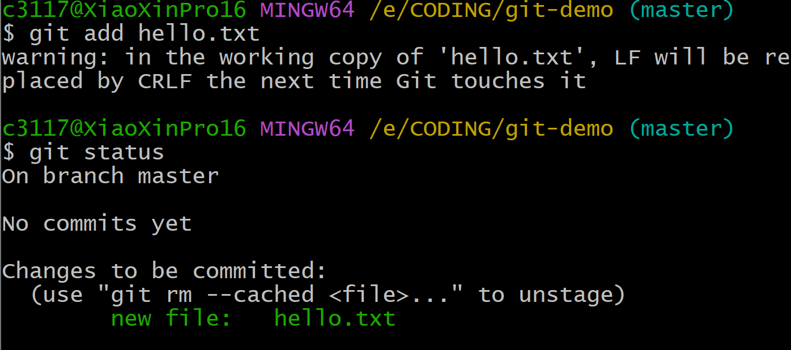
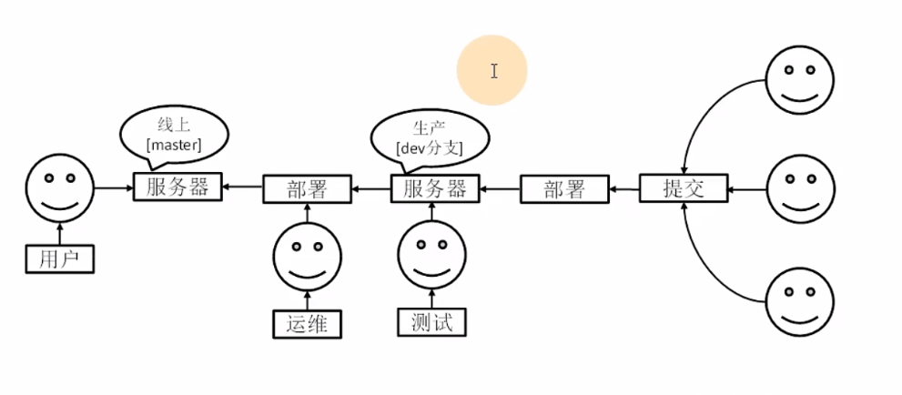
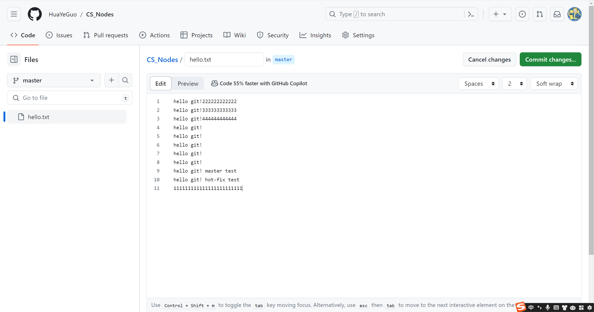

# Git与Github使用说明书——by HuaYeGuo

## 一、Git操作

### （一）Git概述

​	**Git**（读音为/gɪt/）是一个开源的**分布式版本控制系统**，可以有效、高速地处理从很小到非常大的项目版本管理。	

* ##### tip1:何为版本控制？

​	版本控制是指对软件开发过程中各种程序代码、配置文件及说明文档等文件变更的管理，是软件配置管理的核心思想之一。

翻译成人话：如果你想**查看文件夹中代码文件的修改历史记录或历史版本**，亦或者**进行版本切换**。。。	

* ##### tip2:为什么需要版本控制？

个人开发过渡到团队协作。（你不是一个人在战斗！！！）			

​	例如：小明与小红同时开发一个web前端项目，当小明完成一部分功能后提交到服务器，小红完成一部分功能后也提交到服务器。这样服务器就能同时处理这两人的进度。既方便又可以看看两人完成的情况，代码提交量，代码的修改记录等等。这样代码审核的时候谁出问题就能找谁“背锅”了。

### （二）工作机制

* 工作区：代码文件存储在本地磁盘的目录位置，即你写代码的地方，写好了可以添加到暂存区。

* 暂存区：文件临时存储的地方，可以删除，不会产生历史版本。

* 本地库：暂存区的文件提交到这就不能删除了！会产生历史版本以及相关记录。

### （三）代码托管中心

​	代码托管中心是基于网络服务器的远程代码仓库，一般简称**远程库**。

* 局域网
	- **GitLab**
* 互联网
	- **GitHub（外网）**
	- **Gitee码云（国内）**

​		……

### （四）Git常用命令

| 命令名称                               |      作用      |
| :------------------------------------- | :------------: |
| git config  – –global user.name 用户名 |  设置用户签名  |
| git config  – –global user.name 邮箱   |  设置用户签名  |
| git init                               |  初始化本地库  |
| git status                             | 查看本地库状态 |
| git add 文件名                         |  添加到暂存区  |
| git commit –m“日志信息” 文件名         |  提交到本地库  |
| git reflog                             |  查看历史记录  |
| git reset – –hard 版本号               |    版本穿梭    |

#### 1.设置用户签名

##### 基本语法：

* git config  – –global user.name 用户名

* git config  – –global user.name 邮箱

##### 说明：

​	签名的作用在于区分不同操作者身份，用户签名信息在每一个版本提交信息中都能够看到，能确认本次提交的人是谁。**Git首次安装必须设置一下用户签名，否则无法提交代码。**

#### 2.初始化本地库与查看本地库状态

##### 基本语法：

* git init
* git status

##### 说明：

#### 3.将文件添加到暂存区与删除暂存区文件

##### 基础语法：

* git add
* git rm  – –catch 文件名

##### 说明：

* **添加到暂存区：**

* **从暂存区删除：**

#### 4.提交本地库

##### 基本语法：

* git commit –m”日志信息“ 文件名

##### 说明：

#### 5.查看历史记录

#####  基本语法：

* git reflog
* git log (详细)

##### 说明：

#### 6.修改文件后的情况

* **修改文件：**在原有基础上增加了一串数字。。。

* **查看一下修改的状态：**显示了modified

* **重新提交到本地库：**

* **查看日志：**

#### 7.版本穿梭

##### 基本语法：

* git reset – –hard 版本号

##### 说明：

* **tips:利用git reflog查看版本号:**

* **此时的文件：**回溯成功！！！

### （五）Git分支操作

#### 1.什么是分支？

​	在版本控制过程中，同时推进多个任务，为每个任务（父本），我们就可以创建每个任务的单独分支（子任务）。让程序员在自己的工作中从开发主线上分离开来，开发自己的分支（子任务）的时候，不会影响主线（父本）的运行。

#### 2.分支的好处

​	同时并进推动程序多个功能的开发，提高开发效率。

​	各个分支开发独立，一个分支开发失败，不会对其它分支有任何影响。失败分支删除重新开始即可。

#### 3.分支的操作

|      命令名称       |            作用            |
| :-----------------: | :------------------------: |
|  git branch 分支名  |          创建分支          |
|    git branch -v    |          查看分支          |
| git checkout 分支名 |          切换分支          |
|  git merge 分支名   | 把指定分支合并到当前分支上 |

##### 3.1查看分支与创建分支

######  基本操作：

* git branch 分支名

* git branch -v

##### 3.2修改分支与切换分支

###### 基本操作：git cheakout 分支名

* **在hot-fix分支上修改文件hello.txt**

* **回归主线（父本）**

##### 3.3合并分支

###### 基本操作：

* git merge 分支名

##### 3.4解决合并冲突

###### 合并冲突产生原因：

​	合并分支时，两个分支在**同一个文件的同一个位置**有两套不同的修改。Git无法替我们决定使用哪一个。必须**人为决定**新代码内容。

* **修改master文件：**

* **修改hot-fix文件:**

* **手动修改合并两个分支并重新提交：**

* **tips:合并后提交commit + “日志信息” 后不加文件名**

## 二、Git团队协作机制

### （一）团队内合作

### （二）跨团队合作

## 三、GitHub操作

**官网：**https://github.com/

### 1.创建远程仓库

### 2.创建远程仓库别名

##### 基本语法：

* git remote -v **查看当前所有远程地址别名**

* git remote add 别名 远程地址 **创建远程仓库**

##### 说明：

**1.远程地址：**

**2.操作说明：**

### 3.删除远程仓库

##### 基本语法：

* git remote rm （远程库）别名

##### 说明：

### 4.推送本地分支到远程仓库

##### 基本语法：

* git push 别名 分支

##### 说明：

### 5.拉取远程仓库到本地分支

##### 基本语法：

* git pull 别名 分支

##### 说明：

修改文件：

### 6.克隆远程仓库到本地库

##### 基本语法：

* git clone 远程地址

##### 说明：

