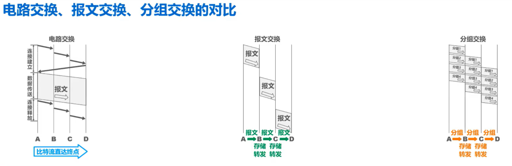

# 电路交换、报文交互、分组交换的优缺点

《计算机网络（第八版）谢希仁》p17

## 电路交换：

### 优点：

**1.通信时延小**:通信线路为通信双方用户专用，数据直达，当连续传输大量数据时，这一优点非常明显。

**2.有序传输：**通信双方之间只有一条专用的通信线路，数据只在这一条线路传输，因此不存在失序问题。

**3.没有冲突：**不同的通信双方拥有不同的信道，不会出现争用物理信道的问题。

**4.适用范围广：**电路交换即适用于传输模拟信号，也适用于传输数字信号。

**5.实时性强：**得益于通信时延小的特点。

**6.控制简单：**电路交换的结点交换机及其控制都比较简单。

### 缺点：

**1.建立连接时间长：**电路交换的平均连接建立时间对计算机通信来说太长。

**2.线路独占，使用效率低：**电路交换一旦建立连接物理通路就被通信双方独占，即使通信线路空闲，也不能够供其他用户使用，因而信道使用率很低。

**3.灵活性差：**只要连接的物理通路中的任何一点出现故障，就必须重新拨号建立新的连接，对十分紧急和重要的通信很不利。

**4.难以规格化：**电路交换时，数据直达，不同类型、不同规格、不同速率的终端很难相互进行通信，也难以在通信过程中进行差错控制。

## 报文交换：

### 优点：

**1.无需建立连接：**报文交换不需要为通信双方预先建立一条专用的通信线路，不存在建立连接的时延，用户可以随时发送报文。

**2.动态分配线路：**当发送方把报文传送给结点交换机时，结点交换机先存储整个报文，然后选择一条合适的空闲线路，把报文发送出去。

**3.提高线路可靠性：**若某条传输路径发生故障，会重新选择另一条路径传输数据，因此提高了线路的可靠性。

**4.提高线路利用率：**通信双方不是固定占用一条通信线路，而是在不同的时间分段部分占用物理线路，因而提高了通信线路的利用率。

**5.提供多目标服务：**一个报文可以同时发送给多个目标地址，这在电路交换中难以实现。

### 缺点：

**1.引起了转发时延：**因为报文在结点交换机上要经历存储转发的过程。

**2.需要较大的存储缓存空间：**因为报文交换对报文的大小没有限制。

**3.需要传输额外的信息量：**报文需要携带目标地址、源地址等信息。

## 分组交换：

### 优点：

**1.无需建立连接：**分组交换不需要为通信双方预先建立一条专用的通信线路，不存在建立连接的时延，用户可以随时发送分组。

**2.线路利用率高：**通信双方不是固定占用一条通信线路，而是在不同的时间分段部分占用物理线路，因而提高了线路利用率。

**3.简化了存储管理：**相对于报文交换而言。因为分组长度固定，相对缓冲区的大小也固定，管理起来相对容易。

**4.加速传输：**由于分组是逐个传输的，这使得后一个分组的传输存储操作与前一个分组的转发操作可以同时进行。

**5.减少了出错概率和重发数据量：**因为分组比报文小，因此出错概率必然减小，即便分组出错，也只需重传出错的分组，比重传整个报文的数据量小很多，这样不仅提高了可靠性，也减少了传输时延。

### 缺点：

**1.引起了转发时延：**因为分组在结点交换机上要经历存储转发的过程。

**2.需要传输额外的信息量：**将原始报文分割成等长的数据块，每个数据块都要加上源地址、目的地址等控制信息，从而构成分组。

**3.对于数据报服务，存在失序、丢失或重复分组的问题；对于虚电路服务，存在呼叫建立、数据传输和虚电路释放三个过程：**

